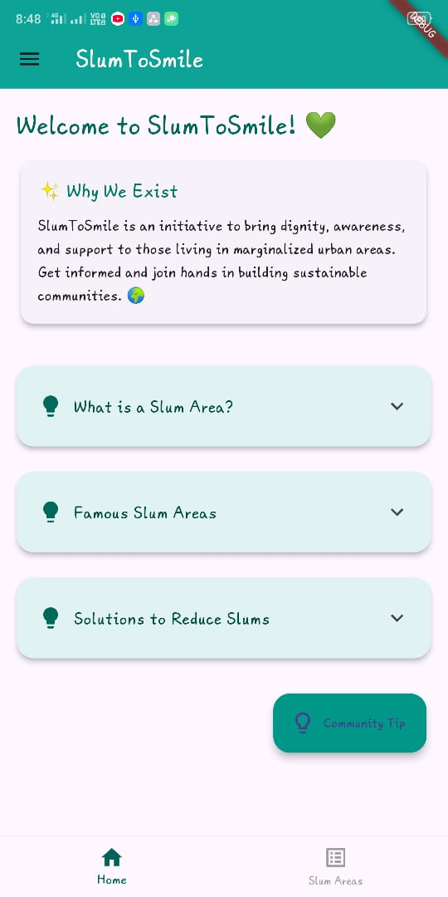
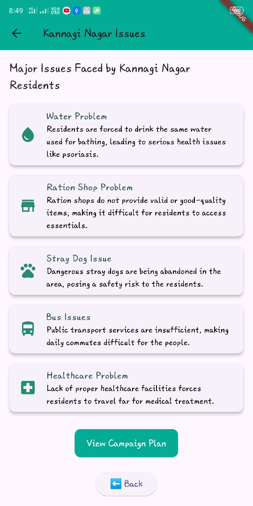
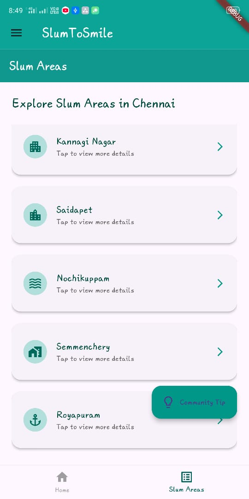

## Summary

SlumToSmile is a mobile-based developmental system designed to improve the lives of individuals residing in slum areas. Built using Flutter and Dart, this application provides a centralized platform for social workers, welfare trusts, and volunteers to identify and address key issues affecting slum communities, such as education, health, employment, housing, and sanitation. The application is developed using Flutter [@flutter2023] and Dart [@dart2023].

This app empowers NGOs, government bodies, and individual volunteers to document needs, provide services, and track improvements in real time. It is lightweight, user-friendly, and scalable for various urban and semi-urban environments. SlumToSmile is not just a reporting tool—it is a platform for action and collaboration aimed at social transformation.

  
  
  

## Statement of need

Despite various efforts from NGOs and government agencies, the lack of a unified digital tool has made slum development work fragmented and inefficient. SlumToSmile addresses this gap by providing a one-stop solution to record, manage, and monitor all critical aspects of slum welfare.

Unlike existing apps that focus on a single domain (e.g., health or education), SlumToSmile brings together all necessary components into one unified system. This makes it easier for social workers and welfare organizations to coordinate their efforts, prioritize urgent cases, and ensure that no community need is overlooked.

## References

::: {#refs}
:::
